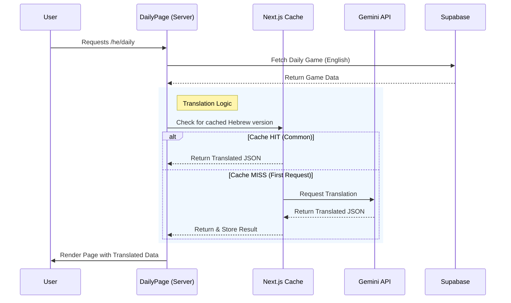

# Daily Game Translation & Caching Mechanism

This document explains how the Daily Game is translated into different languages (specifically Hebrew) and how the caching system ensures performance and cost-efficiency.

---

## 🟢 For Product Managers (Non-Technical)

### **What is it?**
The daily game content (Theme, Words, hints) is originally created in **English**. When a user plays in a different language (e.g., Hebrew), we use an AI (Gemini) to "smartly translate" the game on the fly so that the word associations still make sense in the local culture.

### **The "Smart Copy" Cache**
Since the daily game is the same for everyone on a given day, we don't want to ask the AI to translate the same game thousands of times (which would be slow and cost money).
Instead, we use a **Caching Mechanism** (think of it as a "Smart Copy" system):

1.  **First User**: The *very first* person to play the daily game in Hebrew for a specific day triggers the translation. It takes a second or two.
2.  **The Save**: Once translated, we **save (cache)** this Hebrew version instantly.
3.  **Everyone Else**: Every subsequent user who plays that day gets the **saved copy** instantly. No AI processing is needed.

### **How long does it stay?**
*   **Duration**: The translation is stored **indefinitely** for that specific game.
*   **Why?** The game content doesn't change after it's published. Changing the translation mid-day would confirm to users they are playing different versions, so we keep it locked.
*   **Updates**: If we find a mistake, developers can manually clear the "Smart Copy" to force a new translation, but usually, it stays forever to ensure consistency.

---

## 🔴 For Developers (Technical)

The implementation leverages **Next.js `unstable_cache`** to memoize the result of the Gemini API call.

### **Key Components**
1.  **`src/lib/dailyTranslation.ts`**: Contains the core logic.
    *   `translateDailyGame()`: Calls the Gemini API (`generateContent`) with a specific prompt to translate the Theme, Words, and Generate new localized Hints.
    *   `getCachedTranslatedDailyGame()`: Wraps the translation function with `unstable_cache`.
2.  **`src/app/[locale]/daily/page.tsx`**: The server component that orchestrates the flow.

### **The Caching Strategy**
*   **Method**: `next/cache` -> `unstable_cache`.
*   **Cache Key**: `['daily-translation', gameId, locale]`. This ensures unique cache entries per game ID and language.
*   **Revalidation**: `revalidate: false`.
    *   This sets the cache to persist **indefinitely** (or until the Next.js Data Cache is cleared/redeployed).
    *   This is appropriate because the source data (`daily_games` row) is immutable for that date.

### **Fallbacks & Error Handling**
*   **API Failure**: If Gemini fails or returns invalid JSON, the system logs the error and returns `null`.
*   **User Experience**: The user is silently served the **English** version as a fallback, ensuring the game is always playable even if translation services are down.

---

## 🔄 Process Flow

### **User Request Flow**

---

## 🧪 Common Scenarios

| Scenario | Behavior | Performance | Cost |
| :--- | :--- | :--- | :--- |
| **First User (Hebrew)** | Triggers Gemini API translation. Response stored in Cache. | Slightly Slower (~1-2s) | 1 API Call |
| **Subsequent Users (Hebrew)** | Fetches from Cache. logic is skipped. | Instant | $0 |
| **English User** | No translation logic executed. | Instant | $0 |
| **Translation Fails** | API Error/Timeout. Fallback to English content. | Normal | $0 (if blocked) |
| **New Deployment** | Next.js Data Cache *persist* across deploys (usually), but if cleared, the next user triggers re-translation. | - | - |

