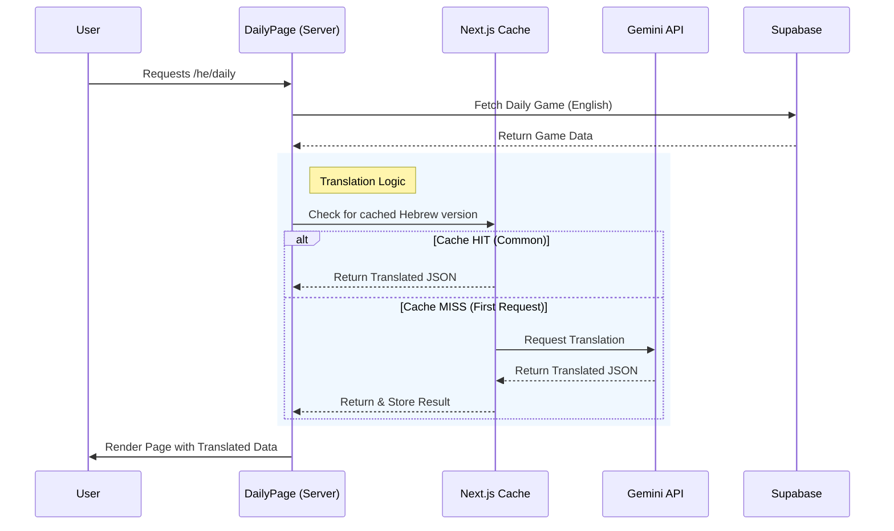

# Daily Game Translation & Caching Mechanism

This document explains how the Daily Game is translated into different languages (specifically Hebrew) and how the caching system ensures performance and cost-efficiency.

---

## 🟢 For Product Managers (Non-Technical)

### **What is it?**
The daily game content (Theme, Words, hints) is originally created in **English**. When a user plays in a different language (e.g., Hebrew), we use an AI (Gemini) to "smartly translate" the game on the fly so that the word associations still make sense in the local culture.

### **The "Smart Copy" Cache**
Since the daily game is the same for everyone on a given day, we don't want to ask the AI to translate the same game thousands of times (which would be slow and cost money).
Instead, we use a **Caching Mechanism** (think of it as a "Smart Copy" system):

1.  **First User**: The *very first* person to play the daily game in Hebrew for a specific day triggers the translation. It takes a second or two.
2.  **The Save**: Once translated, we **save (cache)** this Hebrew version instantly.
3.  **Everyone Else**: Every subsequent user who plays that day gets the **saved copy** instantly. No AI processing is needed.

### **How long does it stay?**
*   **Duration**: The translation is stored for **24 hours** — the puzzle's own lifetime.
*   **Why?** The game content doesn't change after it's published. Changing the translation mid-day would confirm to users they are playing different versions, so we keep it locked.
*   **Updates**: If we find a mistake, developers can manually clear the "Smart Copy" to force a new translation, but within a day it stays put so everyone plays the same puzzle.

### **Wrong-language hints (fixed 2026-09-06)**

Hebrew players sometimes saw a hint with an Arabic word in it — e.g.
`דיבור חרישי שנשמע بالكاد`, where the last word is Arabic for "barely".

The AI was being asked to translate into `"he"` — a two-letter code, with no
mention of Hebrew, and nothing checking what came back. The model occasionally
drifted into the neighbouring right-to-left language, and because the result is
cached for the day, that one bad translation was then served to **every** Hebrew
player until the cache expired.

Now the AI is told the language by name, told which script to write in, and told
explicitly not to use Arabic. Whatever it returns is checked character by
character before anyone sees it: if a hint carries the wrong script, the AI is
asked once more with the specific mistake quoted back at it, and if it fails
again the day's puzzle is served in **English** for that player rather than in a
mixed-up language. A bad translation is never saved to the cache.

---

## 🔴 For Developers (Technical)

The implementation leverages **Next.js `unstable_cache`** to memoize the result of the Gemini API call.

### **Key Components**
1.  **`src/lib/dailyTranslation.ts`**: Contains the core logic.
    *   `translateDailyGame()`: Calls the Gemini API (`generateContent`) in JSON mode
        (`responseMimeType: application/json`, `temperature: 0.3`) to translate the
        Theme and Words and generate new localized Hints. Retries once with the
        rejection reasons appended when the script check fails.
    *   `getCachedTranslatedDailyGame()`: Wraps the translation function with `unstable_cache`.
2.  **`src/lib/daily/translationPrompt.ts`**: Builds the prompt. Names the target
    **language** and **script**, and names the confusable script for `he`/`ar`.
3.  **`src/lib/daily/translationScript.ts`**: The script guard —
    `checkTranslationScript()` classifies every character of the payload and
    reports which field carries the wrong writing system.
4.  **`src/app/[locale]/daily/page.tsx`**: The server component that orchestrates the flow.

### **The Caching Strategy**
*   **Method**: `next/cache` -> `unstable_cache`.
*   **Cache Key**: `['daily-translation', gameId, locale]`. This ensures unique cache entries per game ID and language.
*   **Revalidation**: `revalidate: 86400` (24h).
    *   One day is the puzzle's own lifetime, so in practice an entry is translated once and read for the rest of that day.
    *   (This section used to say `revalidate: false` / "indefinitely". The code has said 86400; corrected 2026-09-06.)

### **Fallbacks & Error Handling**
*   **API Failure**: If Gemini fails or returns invalid JSON, the system logs the error and returns `null` (which *is* cached, so the locale runs on English for the day).
*   **Script rejection**: If the payload fails `checkTranslationScript()` twice, `translateDailyGame()` **throws** `TranslationRejectedError`. `unstable_cache` stores returned values but never stores a rejection, so a drifted generation costs that one request its translation instead of costing the locale its whole day — the next request tries again.
*   **Stale cache entries**: `page.tsx` re-runs `checkTranslationScript()` on whatever comes back from the cache. The Next.js data cache survives deploys, so an entry written before the guard existed would otherwise keep being served.
*   **User Experience**: The user is silently served the **English** version as a fallback, ensuring the game is always playable even if translation services are down.

### **The Script Guard (why it exists)**

`gemini-flash-lite-latest` drifts between right-to-left languages. Asked for
locale `"he"` with no other language cue, it intermittently returned Hebrew
hints containing Arabic words (reported 2026-09-06:
`דיבור חרישי שנשמע بالكاد`). Nothing validated the output, and the result is
cached for 24h, so one drifted generation reached every Hebrew player that day.

`checkTranslationScript(payload, locale, expectedWordCount)` rejects:

| Condition | Example (locale `he`) |
| :--- | :--- |
| A character from a script that is neither the locale's nor Latin | `שנשמע بالكاد` |
| A non-Latin locale with **no** native letters in a field | `Quiet speech, barely heard` |
| A non-Latin locale with more Latin letters than native ones | `Barely audible speech is רחש` |
| `words` / `hints` array not the length of the source chain | 7 hints for an 8-word chain |

Latin is tolerated everywhere (proper nouns, numerals). Locale → script and
locale → language name live in the same module, derived from `src/i18n/locales.ts`.

Rejection reasons are written for a human to relay verbatim and are also fed
back into the retry prompt, e.g.
`hints[1] mixes Arabic ("بالكاد") into Hebrew text: "דיבור חרישי שנשמע بالكاد"`.

Tests: `src/lib/daily/translationScript.test.ts`, `src/lib/daily/translationPrompt.test.ts`.

### **Silent Checks (Peeking)**
*   **Purpose**: The Admin Dashboard needs to know *if* a game is translated without triggering a new translation.
*   **Mechanism**: Uses `AsyncLocalStorage` (`translationContext`) to pass `isPeek: true`.
*   **Behavior**:
    *   `getCachedTranslatedDailyGame` checks the context.
    *   If `isPeek` is set, `translateDailyGame` **throws a specific error** (`CACHE_MISS_PEEK`) instead of calling the API.
    *   Logs are suppressed in this mode to avoid noise.

---

## 🔄 Process Flow

### **User Request Flow**

---

## 🧪 Common Scenarios

| Scenario | Behavior | Performance | Cost |
| :--- | :--- | :--- | :--- |
| **First User (Hebrew)** | Triggers Gemini API translation. Response stored in Cache. | Slightly Slower (~1-2s) | 1 API Call |
| **Subsequent Users (Hebrew)** | Fetches from Cache. logic is skipped. | Instant | $0 |
| **English User** | No translation logic executed. | Instant | $0 |
| **Translation Fails** | API Error/Timeout. Fallback to English content. | Normal | $0 (if blocked) |
| **Wrong script returned** | Retried once with the mistake quoted back; if it fails again the request serves English and nothing is cached. | Slower (2 API calls) | 2 API calls |
| **New Deployment** | Next.js Data Cache *persist* across deploys (usually), but if cleared, the next user triggers re-translation. | - | - |

